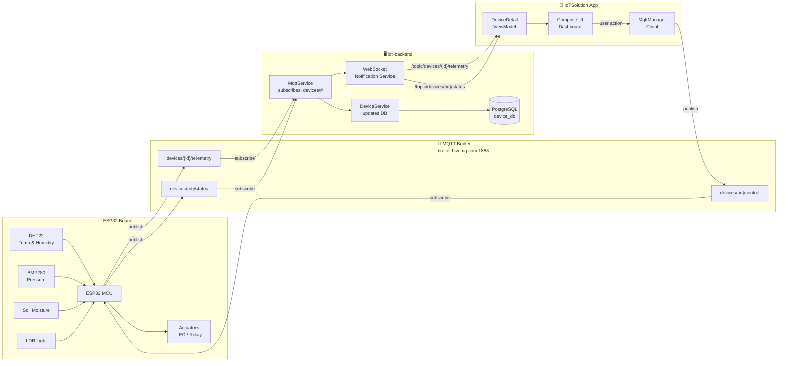
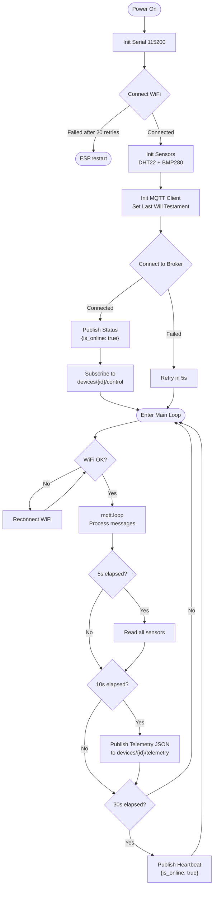
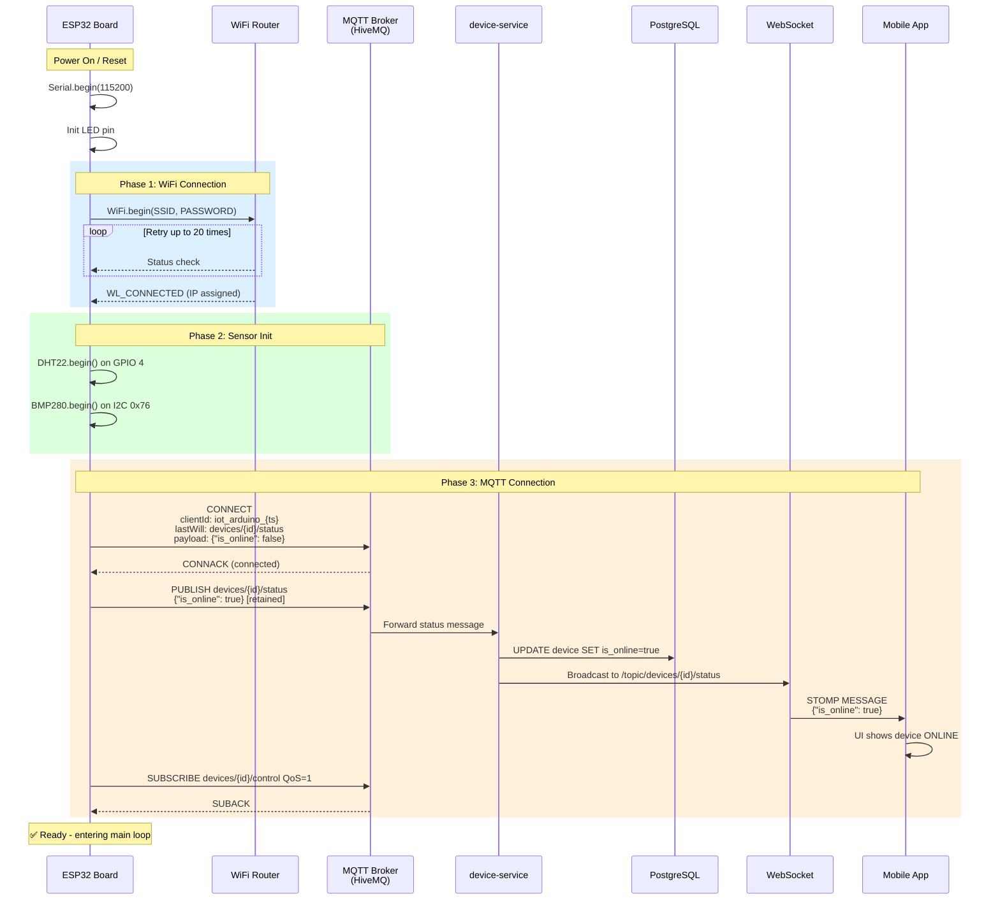
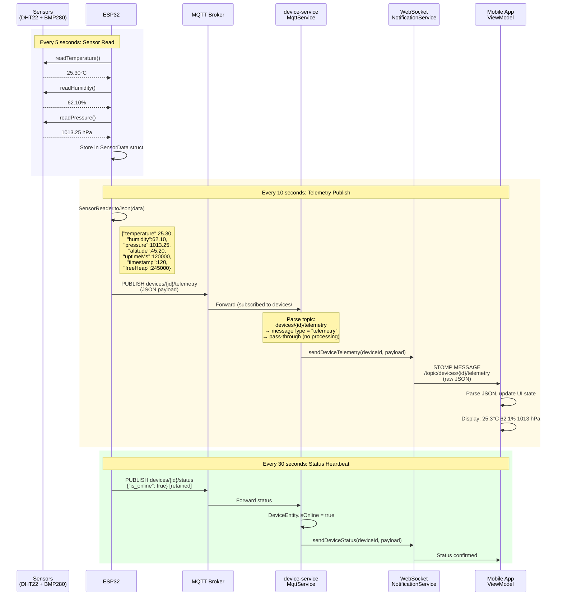
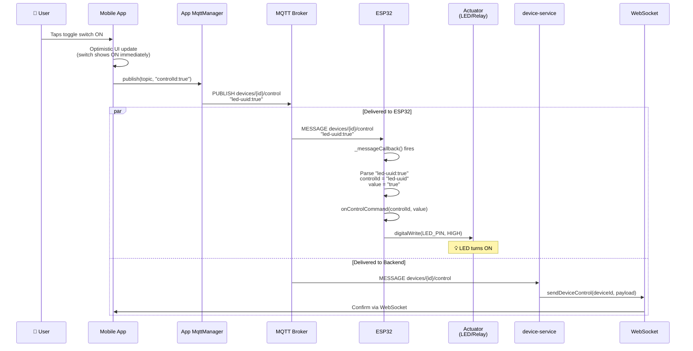
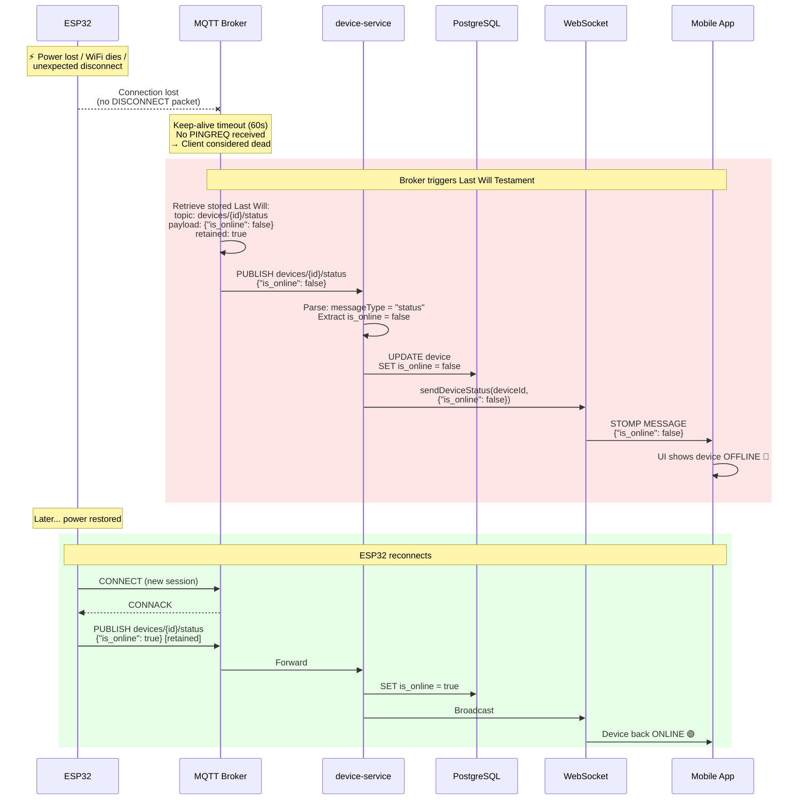
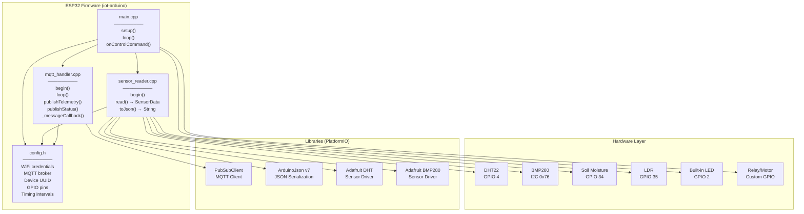

# IoT Solution - ESP32 Sensor Firmware

Arduino firmware for ESP32 that reads sensor data and communicates with the **iot-backend** (device-service) and **IoTSolution** mobile app via MQTT.

---

## Table of Contents

- [Architecture Overview](#architecture-overview)
- [System Flow Diagram](#system-flow-diagram)
- [Sequence Diagrams](#sequence-diagrams)
  - [1. Boot & Connection](#1-boot--connection)
  - [2. Telemetry Publishing](#2-telemetry-publishing)
  - [3. Control Command (App → Device)](#3-control-command-app--device)
  - [4. Device Disconnect (Last Will)](#4-device-disconnect-last-will)
- [Component Diagram](#component-diagram)
- [MQTT Topic Schema](#mqtt-topic-schema)
- [Message Formats](#message-formats)
- [Hardware Setup](#hardware-setup)
- [Configuration](#configuration)
- [Build & Flash](#build--flash)

---

## Architecture Overview

The system consists of **four components** communicating through a central MQTT broker:

```
┌─────────────────────────────────────────────────────────────────────────────┐
│                          SYSTEM ARCHITECTURE                                │
│                                                                             │
│  ┌───────────┐       ┌──────────────┐       ┌──────────────┐               │
│  │  ESP32    │       │  MQTT Broker │       │  iot-backend │               │
│  │  Board    │◀─────▶│  (HiveMQ)    │◀─────▶│device-service│               │
│  │          │  MQTT  │  Port: 1883  │  MQTT │  Port: 8082  │               │
│  └───────────┘       └──────────────┘       └──────┬───────┘               │
│   Sensors:                                         │ WebSocket              │
│   - DHT22 (temp/hum)                               │ (STOMP)               │
│   - BMP280 (pressure)                              │                        │
│   - Soil Moisture                           ┌──────▼───────┐               │
│   - LDR (light)                             │  Mobile App  │               │
│                                              │ (IoTSolution)│               │
│   Actuators:                                │  Android/    │               │
│   - LED / Relay                             │  Kotlin      │               │
│   - Motor / Fan                             └──────────────┘               │
│                                                                             │
└─────────────────────────────────────────────────────────────────────────────┘
```

**Communication Protocols:**

| Path | Protocol | Purpose |
|------|----------|---------|
| ESP32 ↔ Broker | MQTT (TCP:1883) | Sensor data out, control commands in |
| Backend ↔ Broker | MQTT (TCP:1883) | Receives telemetry, sends controls |
| Backend → App | WebSocket (STOMP) | Real-time push to mobile UI |
| App → Backend | REST (HTTP) | Device CRUD, authentication |
| App → Broker | MQTT (TCP:1883) | Direct control commands |

---

## System Flow Diagram

### High-Level Data Flow



### Detailed Internal Flow (ESP32)



---

## Sequence Diagrams

### 1. Boot & Connection



### 2. Telemetry Publishing



### 3. Control Command (App → Device)



### 4. Device Disconnect (Last Will)



---

## Component Diagram



---

## MQTT Topic Schema

All topics follow the pattern expected by `device-service/MqttService.java`:

```
devices/{deviceId}/{messageType}
   │         │           │
   │         │           ├── status      ESP32 → Backend  (online/offline)
   │         │           ├── telemetry   ESP32 → Backend  (sensor readings)
   │         │           └── control     App   → ESP32    (commands)
   │         │
   │         └── UUID from backend (e.g., "a1b2c3d4-e5f6-...")
   │
   └── Fixed prefix
```

| Topic | Direction | Publisher | Subscriber | QoS | Retained |
|-------|-----------|-----------|------------|-----|----------|
| `devices/{id}/status` | ESP32 → Backend | ESP32 | device-service | 1 | Yes |
| `devices/{id}/telemetry` | ESP32 → Backend | ESP32 | device-service | 1 | No |
| `devices/{id}/control` | App → ESP32 | Mobile App | ESP32 | 1 | No |

---

## Message Formats

### Status Message
```json
{
  "is_online": true
}
```
Published on connect, every 30s as heartbeat, and `false` via Last Will on disconnect.

### Telemetry Message
```json
{
  "temperature": 25.30,
  "humidity": 62.10,
  "pressure": 1013.25,
  "altitude": 45.20,
  "soilMoisture": 72,
  "lightLevel": 3200,
  "uptimeMs": 120000,
  "timestamp": 120,
  "freeHeap": 245000
}
```
Fields are conditionally included based on which sensors are enabled and returning valid data.

### Control Command (received by ESP32)
```
controlId:value
```
Examples: `led-uuid:true`, `fan-speed-uuid:75`, `mode-uuid:auto`

---

## Hardware Setup

### Wiring Diagram

```
                    ┌─────────────────────┐
                    │      ESP32 Board     │
                    │                      │
    DHT22 ─────────┤ GPIO 4         GPIO 2├──── Built-in LED
    (Data)          │                      │
                    │ GPIO 21 (SDA)        │
    BMP280 ─────────┤ GPIO 22 (SCL)       │
    (I2C)           │                      │
                    │ GPIO 34 (ADC)        │
    Soil Sensor ────┤ (Analog In)          │
                    │                      │
                    │ GPIO 35 (ADC)        │
    LDR ────────────┤ (Analog In)          │
                    │                      │
                    │ 3.3V ────── VCC (sensors)
                    │ GND  ────── GND (sensors)
                    └─────────────────────┘
```

### Pin Mapping

| Component | ESP32 Pin | Type | Notes |
|-----------|-----------|------|-------|
| DHT22 Data | GPIO 4 | Digital | 10K pull-up to 3.3V |
| BMP280 SDA | GPIO 21 | I2C | Built-in I2C bus |
| BMP280 SCL | GPIO 22 | I2C | Built-in I2C bus |
| Soil Moisture | GPIO 34 | Analog | ADC input only |
| LDR | GPIO 35 | Analog | ADC input only |
| LED (built-in) | GPIO 2 | Digital | Active HIGH |

---

## Configuration

Edit `include/config.h` before flashing:

### Required Settings

```cpp
// Your WiFi network
#define WIFI_SSID       "MyWiFi"
#define WIFI_PASSWORD   "MyPassword"

// Device UUID from backend (create device via mobile app first)
#define DEVICE_ID       "a1b2c3d4-e5f6-7890-abcd-ef1234567890"
```

### Optional: Enable/Disable Sensors

```cpp
#define BMP280_ENABLED         true    // I2C pressure sensor
#define SOIL_MOISTURE_ENABLED  false   // Analog soil sensor
#define LDR_ENABLED            false   // Analog light sensor
```

### Optional: Adjust Timing

```cpp
#define TELEMETRY_INTERVAL   10000  // Publish sensor data every 10s
#define STATUS_INTERVAL      30000  // Heartbeat every 30s
#define SENSOR_READ_INTERVAL  5000  // Read sensors every 5s
```

---

## Build & Flash

### Prerequisites

1. Install [PlatformIO CLI](https://platformio.org/install/cli) or [VS Code Extension](https://platformio.org/install/ide?install=vscode)
2. Connect ESP32 board via USB

### Steps

```bash
# Navigate to project
cd iot-arduino

# Build firmware
pio run

# Flash to ESP32
pio run --target upload

# Monitor serial output
pio device monitor --baud 115200
```

### Expected Serial Output

```
========================================
  IoT Solution - ESP32 Sensor Board
  Device: a1b2c3d4-e5f6-7890-abcd-ef1234567890
========================================
[WiFi] Connecting to MyWiFi.....
[WiFi] Connected! IP: 192.168.1.105
[Sensor] DHT22 initialized on GPIO 4
[Sensor] BMP280 initialized at 0x76
[MQTT] Broker: broker.hivemq.com:1883
[MQTT] Connecting as iot_arduino_12345...
[MQTT] Connected!
[MQTT] Status: {"is_online":true}
[MQTT] Subscribed to: devices/a1b2c3d4-.../control
[Setup] Ready! Telemetry every 10s
[MQTT] Telemetry sent: {"temperature":25.30,"humidity":62.10,...}
```

---

## Setup Checklist

1. **Backend**: Register a device via REST API or mobile app → get the device UUID
2. **Config**: Set `DEVICE_ID` in `config.h` to that UUID
3. **Config**: Set `WIFI_SSID` and `WIFI_PASSWORD`
4. **Wire**: Connect sensors to ESP32 per pin mapping above
5. **Flash**: `pio run --target upload`
6. **Verify**: Open serial monitor, confirm MQTT connected
7. **App**: Open IoTSolution → device should show ONLINE with live telemetry
# IoT_esp32_sensor
